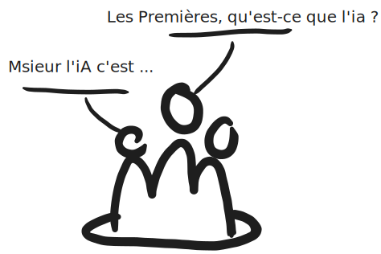

# Séance 1 : Narration avec ChatGPT (2 heures)

## Objectifs de la séance

- Introduire les élèves à l'utilisation de ChatGPT pour enrichir et développer leurs idées créatives.
- Sensibiliser les élèves aux questions de droit d'auteur et de propriété intellectuelle en lien avec l'utilisation des IA.
- Encourager une réflexion sur l'importance de l'autorat et de l'expression personnelle dans les œuvres créatives.
- Initier les élèves à la conception d'une idée de jeu vidéo en s'inspirant de la mécanique des animaux de compagnie, comme dans Pokémon.

## Déroulé détaillé de la séance

### 1. Introduction à la séance et présentation des objectifs (10 minutes)

**Intervention :** Expliquer les objectifs de la séance : Découvrir comment utiliser ChatGPT

pour générer des idées de jeu vidéo tout en réfléchissant à l'importance de l'autorat et de la propriété intellectuelle. Présenter l'importance de produire des idées originales et personnelles.

### 2. Présentation des attentes pour le rendu final (10 minutes)

**Intervention :** Présenter ce qui est attendu des élèves pour cette première séance :

Une planche comprenant :

- Leur première idée naïve.
- Les références collectées et leur analyse.
- La version améliorée de leur idée.

**Attentes :**

- Les élèves doivent comprendre clairement ce qu'ils doivent produire et rendre dans les 5 semaines à venir.
- Comprendre l'intérêt de l'autorat dans le processus de création et savoir utiliser l'IA de manière éthique et créative.

### 3. Discussion interactive sur le copyright et les droits d'auteur (10 minutes)

**Intervention :** Poser des questions pour initier la réflexion :

- **"Qu'est-ce que le copyright ?"**  
    ==Le copyright, ou droit d'auteur, est un ensemble de droits légaux qui protège les créations originales, telles que les œuvres littéraires, artistiques, musicales, cinématographiques, etc. Il confère à l'auteur le droit exclusif de reproduire, distribuer, afficher ou exécuter publiquement son œuvre, et de créer des œuvres dérivées. Le copyright permet ainsi à l'auteur de contrôler l'utilisation de son travail et de recevoir une compensation pour son exploitation.==
    
- **"Pourquoi est-il important dans le domaine de la création ?"**  
    ==Le copyright est essentiel dans le domaine de la création car il protège les droits des auteurs et des créateurs. Il leur permet de tirer profit de leur travail, de reconnaître leur contribution artistique et intellectuelle, et de protéger leurs œuvres contre la copie ou l'utilisation non autorisée. En garantissant une forme de rémunération et de reconnaissance, le copyright encourage l'innovation et la diversité artistique, en incitant les créateurs à produire de nouvelles œuvres sans crainte d'être plagiés.==
    
- **"Quel rôle peut jouer une IA dans la création d'œuvres ?"**  
    ==Une IA peut jouer plusieurs rôles dans la création d'œuvres :
        - **Assistant créatif :** L'IA peut aider à générer des idées, à proposer des variations ou des améliorations, à automatiser certaines tâches répétitives (comme le nettoyage d'images, la vectorisation, etc.), et à offrir de nouvelles perspectives en se basant sur de grandes quantités de données.
        - **Co-auteur :** Dans certains cas, l'IA peut être utilisée pour créer des œuvres originales ou pour collaborer avec des artistes, en apportant une touche unique ou en explorant des domaines créatifs qui ne seraient pas accessibles autrement.
        - **Outil d'inspiration :** L'IA peut suggérer des références, des motifs ou des styles qui inspirent les créateurs et les poussent à innover.
	Cependant, l'utilisation d'une IA dans la création pose aussi des questions éthiques et légales, notamment en ce qui concerne la propriété intellectuelle, l'attribution de la création, et l'impact sur le rôle des artistes humains.==

**Attentes :** Les élèves doivent participer activement et exprimer leurs opinions et leurs connaissances sur le sujet.

### 4. Projection d’un extrait de la vidéo d’Alexandre Astier dans Hot Ones sur l'utilisation des IA (3 minutes)

https://youtu.be/YyalpipMTO0?t=591

**Intervention :** Montrer l'extrait pertinent où Alexandre Astier parle de l'importance de la dimension humaine dans la création et l’utilisation des IA.

**Attentes :** Prendre conscience de l’importance de "mettre ses tripes" dans son travail créatif et de ne pas s'en remettre uniquement à l'IA.

### 5. Débat guidé sur les appels de boycott de l'art créé par l'IA (15 minutes)

**Intervention :** Organiser un mini-débat autour des appels de boycott de l'art par IA. Diviser la classe en deux groupes : un groupe "pour" et un groupe "contre". Chaque groupe doit argumenter ses positions.

**Attentes :** Les élèves doivent participer activement, écouter les arguments des autres et développer une réflexion critique sur l'utilisation des IA dans l'art.

### 6. Conclusion sur l'autorat et transition vers l'exercice créatif (5 minutes)

**Intervention :** Résumer les points clés du débat et conclure sur l'importance de bien présenter la part d'IA dans l'autorat. Expliquer la transition vers l'exercice suivant : l'utilisation de ChatGPT pour enrichir une idée initiale de jeu vidéo.

**Attentes :** Comprendre l'importance de l'originalité et de la transparence dans l'utilisation des IA.

### 7. Sondage sur l'expérience de jeu des élèves et introduction à la démarche naïve (2 minutes)

**Intervention :** Demander qui a déjà fait du design de jeu vidéo ou qui joue régulièrement à des jeux vidéo. Expliquer que le manque d’expérience peut être un avantage, car ils partent d'une démarche naïve et ouverte.

**Attentes :** Encourager une approche ouverte et créative dans la conception du jeu vidéo.

### 8. Exercice de rédaction d'une idée de jeu vidéo (15 minutes)

**Intervention :** Expliquer que les élèves doivent imaginer un concept de jeu vidéo basé sur l’idée d’animaux de compagnie, similaire à Pokémon. Le jeu doit être paisible, enfantin et sans violence.  
**Activité :** Les élèves rédigent un court texte (2-3 phrases) décrivant une situation initiale, un élément déclencheur et une raison pour laquelle le joueur voudrait élever des animaux de compagnie. Cette description est accompagnée de soit un story board soit une scène immersive représentant le jeu. 

Qu'est-ce qu'un storyboard ? ==**Un storyboard est** un outil visuel utilisé pour planifier une narration, que ce soit pour un film, une animation, une publicité, une bande dessinée, ou tout autre projet qui implique une séquence d'images. Il s'agit d'une série de dessins ou de vignettes qui représentent les scènes clés d'une histoire, disposées dans l'ordre dans lequel elles apparaîtront. Chaque vignette décrit un moment précis de l'histoire, avec des détails sur l'action, le cadrage, le dialogue ou les effets visuels et sonores.==

**Attentes :** Produire une idée de jeu simple et originale accompagnée d'une image explicative.

### 9. Recherche de références avec ChatGPT (10 minutes)

**Intervention :** Demander aux élèves d’utiliser ChatGPT pour enrichir leur idée en demandant des références pertinentes (jeux vidéo, œuvres d’art, design, etc.). Proposer un exemple de prompt :

> _"Je travaille sur une idée de jeu vidéo où le joueur élève des animaux de compagnie fantastiques dans un environnement paisible et enfantin. Peux-tu me donner des références de jeux, œuvres littéraires, artistiques ou autres qui pourraient m'inspirer ?"

**Attentes :** Obtenir une liste de références variées pour enrichir leur concept de jeu.

### 10. Tri des données et mise en relation avec l'idée initiale (10 minutes)

**Intervention :** Guider les élèves pour trier les informations obtenues via ChatGPT. Identifier les éléments pertinents qui peuvent enrichir leur concept initial.

**Attentes :** Les élèves doivent organiser les références et les idées collectées de manière claire et cohérente.

### 11. Amélioration de l'idée de jeu (20 minutes)

**Intervention :** Demander aux élèves de réviser leur concept de jeu en intégrant les éléments pertinents des références collectées.

**Attentes :** Produire une version améliorée de leur idée de jeu, plus claire, simple, et intéressante.

---

## Temps total de la séance : 2 heures

## Travail à rendre dans 5 semaines

### Contenu attendu

Une planche comprenant trois parties :

1. **Première idée naïve :** Un texte court et une image explicative de l’idée de jeu de départ.
2. **Récolte d’informations :** Liste des références obtenues via ChatGPT avec une analyse de celles-ci (pourquoi elles sont pertinentes et comment elles enrichissent l’idée de départ).
3. **Amélioration de l’idée :** Une version enrichie et finalisée de l’idée de jeu, avec des éléments nouveaux apportés par les références.

### Critères d’évaluation pour cette séance

- Originalité et pertinence de l’idée de jeu vidéo.
- Qualité des références trouvées et capacité à expliquer leur pertinence.
- Capacité à intégrer les références pour améliorer l’idée initiale.
- Présentation claire et structurée de la planche finale.

---

